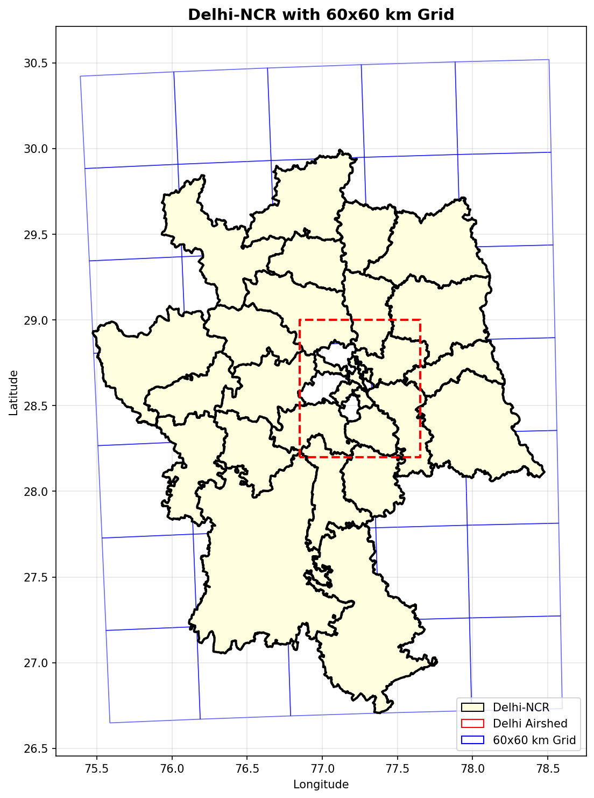
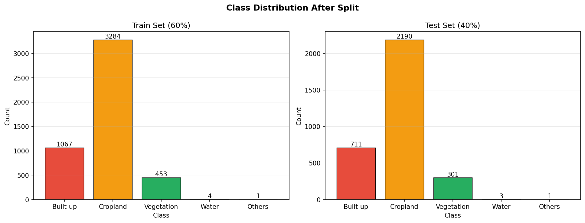
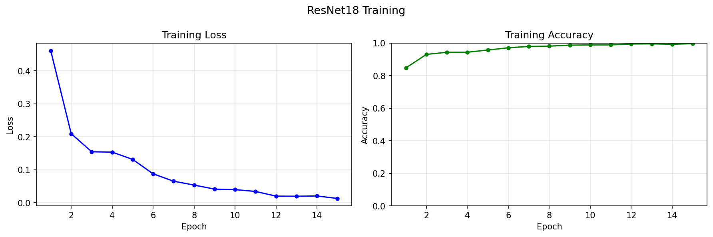
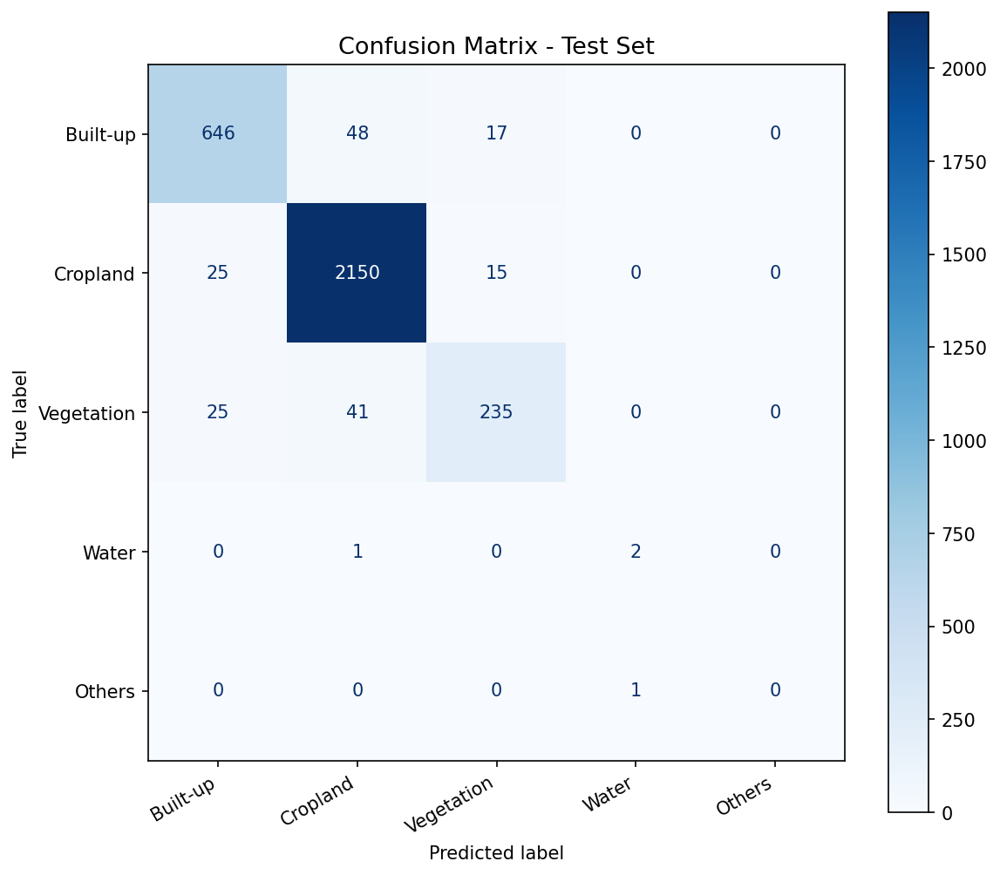

# SRIP 2026 — AI for Sustainability
## Earth Observation: Delhi-NCR Land Use Classification

> **Disclosure:** I used Claude AI to understand specific concepts around rasterio patch extraction and torchvision transfer learning. All code was written, run, and verified by me on Kaggle with GPU T4.

---

## Problem Overview

This is my submission for the SRIP 2026 Earth Observation task under Prof. Nipun Batra.
The goal was to build an end-to-end pipeline for land use classification over the Delhi-NCR region using Sentinel-2 satellite imagery and ESA WorldCover 2021 data.

The Ministry of Environment wants an AI-based audit of the Delhi Airshed to identify land use patterns. Given satellite image patches and a land cover raster, the task involves:
- Spatial filtering of relevant image patches
- Automatic label generation using ESA WorldCover
- Training a CNN classifier on the labeled dataset

---

## Results Summary

| Metric | Value |
|--------|-------|
| Images before filtering | 9216 |
| Images after filtering (inside NCR) | 8015 |
| Train samples | 4809 |
| Test samples | 3206 |
| Test Accuracy | 94.60% |
| Macro F1 Score | 0.6766 |
| Weighted F1 Score | 0.9450 |

### Per Class F1 Scores
| Class | F1 Score |
|-------|----------|
| Cropland | 0.9707 |
| Built-up | 0.9183 |
| Vegetation | 0.8275 |
| Water | 0.6667 |
| Others | 0.0000 |

---

## Pipeline

```
Sentinel-2 RGB patches (9216 images)
        ↓
Q1: Spatial filtering using Delhi-NCR boundary
        ↓ 8015 images remain
Q2: Auto-labeling using ESA WorldCover TIF
        ↓ 60/40 train-test split
Q3: ResNet18 fine-tuned for 15 epochs
        ↓
Test Accuracy: 94.60%
```

---

## Visualizations

### Delhi-NCR with 60×60 km Grid


### Class Distribution (Train vs Test)


### Training Curves


### Confusion Matrix


---

## Key Observations

- **Cropland** dominates the region (~68% of samples) and is classified best (F1: 0.97)
- **Built-up** areas have distinct spectral texture making them easy to separate (F1: 0.92)
- **Vegetation** and Cropland get confused occasionally since both appear greenish in RGB
- **Water** and **Others** have very few samples causing class imbalance — low recall for these
- Macro F1 (0.67) is lower than Weighted F1 (0.94) because it treats all classes equally including rare ones

---

## Libraries Used

- `geopandas` — shapefile and geojson handling
- `rasterio` — extracting patches from GeoTIFF land cover raster
- `shapely` — point-in-polygon spatial filtering
- `scipy` — computing mode (dominant class) of land cover patches
- `scikit-learn` — train-test split, accuracy, F1, confusion matrix
- `PyTorch` + `torchvision` — ResNet18 model training and evaluation
- `matplotlib` — all visualizations

---

## Dataset

[Delhi Airshed Sentinel-2 RGB and Landcover — Kaggle](https://www.kaggle.com/datasets/rishabhsnip/earth-observation-delhi-airshed)
